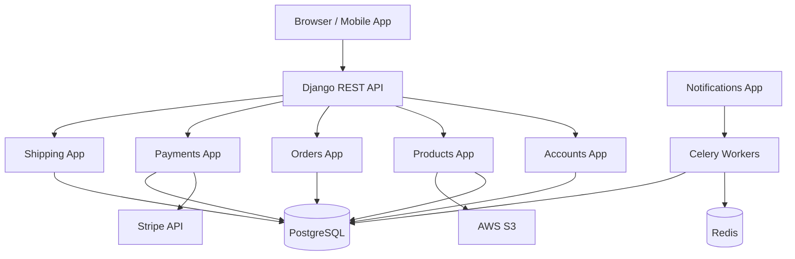
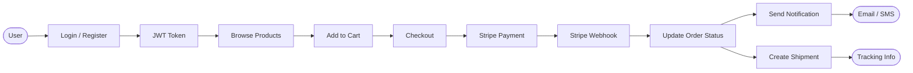
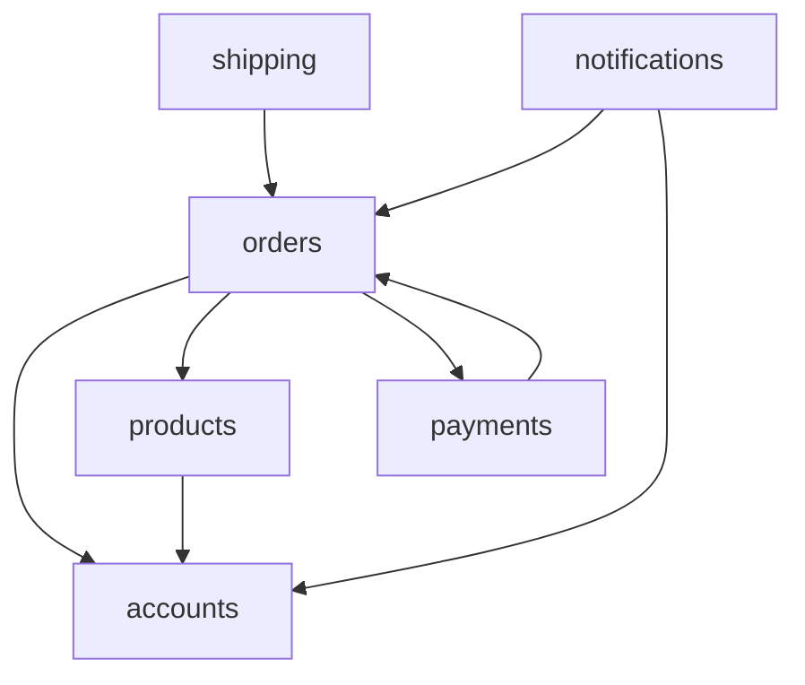

### Component Diagram

```mermaid
graph TD
    Client[Browser / Mobile App]
    API[Django REST API]
    Auth[Accounts App]
    Products[Products App]
    Orders[Orders App]
    Payments[Payments App]
    Shipping[Shipping App]
    Notifications[Notifications App]
    DB[(PostgreSQL)]
    Redis[(Redis)]
    Celery[Celery Workers]
    Stripe[Stripe API]
    S3[AWS S3]

    Client --> API
    API --> Auth
    API --> Products
    API --> Orders
    API --> Payments
    API --> Shipping
    Auth --> DB
    Products --> DB
    Products --> S3
    Orders --> DB
    Payments --> Stripe
    Payments --> DB
    Shipping --> DB
    Notifications --> Celery
    Celery --> Redis
    Celery --> DB
```

### Data Flow

```mermaid
flowchart LR
    User([User]) --> Login[Login / Register]
    Login --> JWT[JWT Token]
    JWT --> Browse[Browse Products]
    Browse --> Cart[Add to Cart]
    Cart --> Checkout[Checkout]
    Checkout --> Payment[Stripe Payment]
    Payment --> Webhook[Stripe Webhook]
    Webhook --> OrderUpdate[Update Order Status]
    OrderUpdate --> Notify[Send Notification]
    Notify --> Email([Email / SMS])
    OrderUpdate --> Ship[Create Shipment]
    Ship --> Track([Tracking Info])
```

### Module Dependencies

```mermaid
graph TD
    orders --> accounts
    orders --> products
    orders --> payments
    payments --> orders
    shipping --> orders
    notifications --> orders
    notifications --> accounts
    products --> accounts
```
